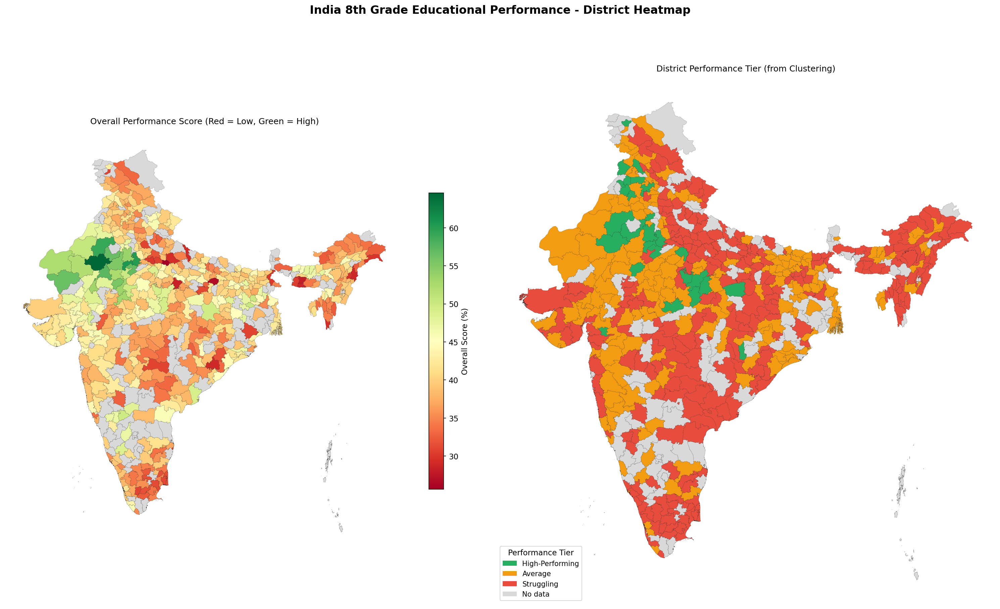

# India District Education Performance Analysis
### National Achievement Survey (NAS) — 8th Grade

I built this to answer one question: **which school districts in India are struggling, and what's actually causing it?**

The dataset is India's National Achievement Survey — a government-run test across 1,399 school districts covering Science, Math, Language and Social Studies learning outcomes for 8th grade students. Instead of just running a model and reporting accuracy, I used three different ML techniques on the same data so each one answers a different question.

---

## What I Found

**Science is the bottleneck, not Math.**
Using SHAP explainability on a Random Forest model, `Sci708` alone accounts for 39% of the variation in a district's overall score — nearly double the next most important feature. All the top drivers are Science topics. Math matters, but it's not the primary differentiator.

**To be in India's top 25%, a district only needs 43.33% overall.**
That's the threshold for being considered "high-performing" nationally. Three quarters of Indian school districts score below that. The problem isn't a few outlier districts — it's systemic.

**Rajasthan is doing something right.**
7 of the top 10 districts nationally are in Rajasthan. Nagaur tops the country at 73.8. Whatever Rajasthan is doing differently in Science education is worth studying and replicating.

**South India is almost entirely in the Struggling tier.**
The geospatial map makes this obvious in a way tables can't — the concentration of red (struggling) districts across southern states points to a regional pattern, not a district-by-district problem.

---

## The Three Models

### 1. Random Forest Regression + SHAP
Predicts a district's overall score from its 55 subject-level learning outcomes. R² = 0.9877.

> **Note on R²:** `overall_score` is partially derived from the same learning outcome columns used as features (it's their mean), so R² is inflated. The SHAP feature rankings are the real insight here — they tell you which subjects drive performance most, and in which direction.

SHAP produces two plots:
- **Bar chart** — which features matter most (magnitude)
- **Beeswarm** — whether high values push the score up or down (direction)

### 2. PCA + K-Means Clustering
Groups districts into three tiers automatically, without any predefined labels.

Compressing 55 features directly into K-Means would suffer from the curse of dimensionality — distances become meaningless in high-dimensional space. PCA reduces to 2 dimensions first (preserving 66.5% of variance), then K-Means finds natural groupings.

| Cluster | Avg Score | Districts |
|---|---|---|
| Struggling | 33.7% | 638 |
| Average | 41.5% | 565 |
| High-Performing | 54.0% | 196 |

### 3. Random Forest Classification + 5-Fold CV
Predicts whether a district will land in the top 25% nationally — using only 3 subject scores (Sci708, Sci703, M803).

| Metric | Value |
|---|---|
| Accuracy | 95% |
| CV Accuracy (5-fold) | 0.940 ± 0.024 |
| Precision (At Risk) | 0.97 |
| Recall (At Risk) | 0.96 |

The low standard deviation across folds means the model is genuinely stable — not getting lucky on one particular split.

`class_weight='balanced'` handles the 75/25 class imbalance. `stratify=y` preserves the class ratio in both train and test sets. Cross-validation runs on a fresh model clone, not the already-fitted one.

---

## Geospatial Map

District scores and cluster tiers are plotted on an actual map of India using GeoPandas. Two panels side by side:
- Left: continuous score heatmap (Red → Yellow → Green)
- Right: cluster tier map (Struggling / Average / High-Performing)

481 of 594 GeoJSON districts matched to the dataset (81%). Unmatched districts appear grey — a normal outcome when joining two independently sourced datasets with different name spellings.



---

## How to Run

**In Google Colab (recommended):**
1. Open `nas_education_final.ipynb` in Colab
2. Upload `cleaned 8th grade dataset.csv` via the Files panel on the left sidebar
3. Run Cell 1 first (installs libraries, downloads GeoJSON)
4. Runtime → Run all

**Libraries needed** (Cell 1 installs these automatically):
```
pandas numpy scikit-learn matplotlib seaborn shap geopandas
```

---

## Files

```
├── nas_education_final.ipynb     # Main notebook — run this
├── cleaned 8th grade dataset.csv # NAS 8th grade data (upload to Colab)
├── india_heatmap.png             # District performance map
├── shap_bar.png                  # SHAP feature importance chart
├── shap_beeswarm.png             # SHAP impact direction chart
├── clustering.png                # PCA cluster scatter + boxplot
├── classification.png            # Confusion matrix + CV accuracy
└── README.md
```

---

## Policy Implications

If this were a real government brief, the recommendations would be:

1. **Fund science labs and specialist science teachers** — Sci708 and Sci703 account for over 58% of feature importance combined. Math funding alone won't move the needle.

2. **Redefine national benchmarks** — a 43.33% threshold for "top 25%" means absolute targets like "50% pass rate" are missing the scale of the problem entirely.

3. **Use the cluster map, not averages** — distributing education aid by state average hides the concentration of struggling districts. The map shows where to target.

4. **Deploy the classifier as an early warning system** — final NAS results take months to compile. A 3-input classifier running on mid-year subject scores could flag at-risk districts 3–6 months earlier.

5. **Study Rajasthan** — 7 of the top 10 districts are there. Something is working. Find out what and replicate it.

---

## Stack

Python · Pandas · Scikit-learn · SHAP · GeoPandas · Matplotlib · Seaborn

**Data:** India National Achievement Survey (NAS), 8th Grade
